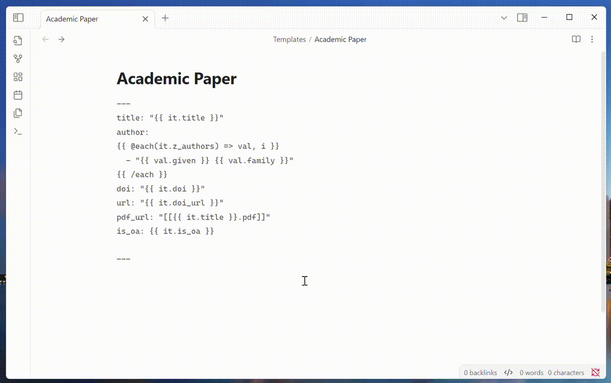

# Paper Clipper

[](https://github.com/ras0q/obsidian-paper-clipper/releases/latest)
[](https://obsidian.md/plugins?id=paper-clipper)

An [Obsidian](https://obsidian.md/) plugin to capture and manage academic papers



## Features

> [!CAUTION]
> This plugin is a work in progress. Please report any issues you encounter.
>
> [Discussion on Reddit](https://www.reddit.com/r/ObsidianMD/comments/1ioa6ai/creating_a_plugin_that_clips_academic_papers_by/)

- [x] Fetch full-text PDFs and metadata from open access sources using a DOI
- [x] Extract DOI and metadata from existing PDFs
- [ ] Auto-organize papers with citation-ready formatting
- [x] Import PDFs into Obsidian with a [bookmarklet](#importing-pdfs)

### Importing PDFs

This plugin implements a custom URI scheme to import PDFs into Obsidian.

```plaintext
obsidian://clip-paper?clipboard=base64
```

You can use the following bookmarklet to import PDFs into Obsidian:

```js
javascript:(async()=>{try{const a=location.href,b=await(await fetch(a)).bytes(),c=b.reduce((d,e)=>d+String.fromCharCode(e),""),f=btoa(c);await navigator.clipboard.writeText(f);location.href="obsidian://clip-paper?clipboard=base64"}catch(a){alert(`Error: ${a}`);console.error(a)}})();
```

<details>

<summary>Full code</summary>

```js
javascript:(async () => {
  try {
    const url = location.href;
    const pdf = await (await fetch(url)).bytes();

    const binaryString = pdf.reduce(
      (acc, byte) => acc + String.fromCharCode(byte),
      "",
    );
    const base64Data = btoa(binaryString);

    await navigator.clipboard.writeText(base64Data);
    location.href = `obsidian://clip-paper?clipboard=base64`;
  } catch (error) {
    alert(`Error: ${error}`);
    console.error(error);
  }
})();
```

</details>
